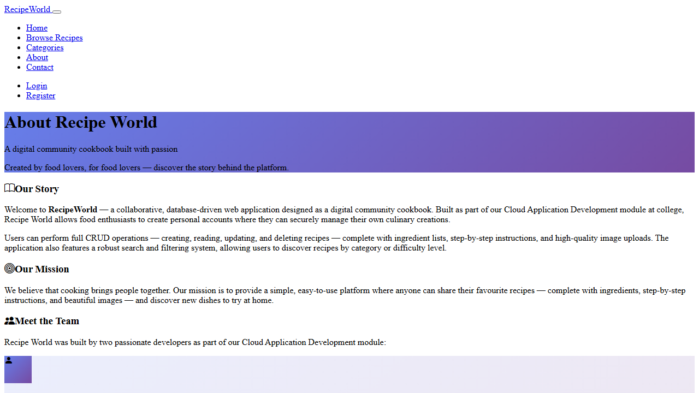
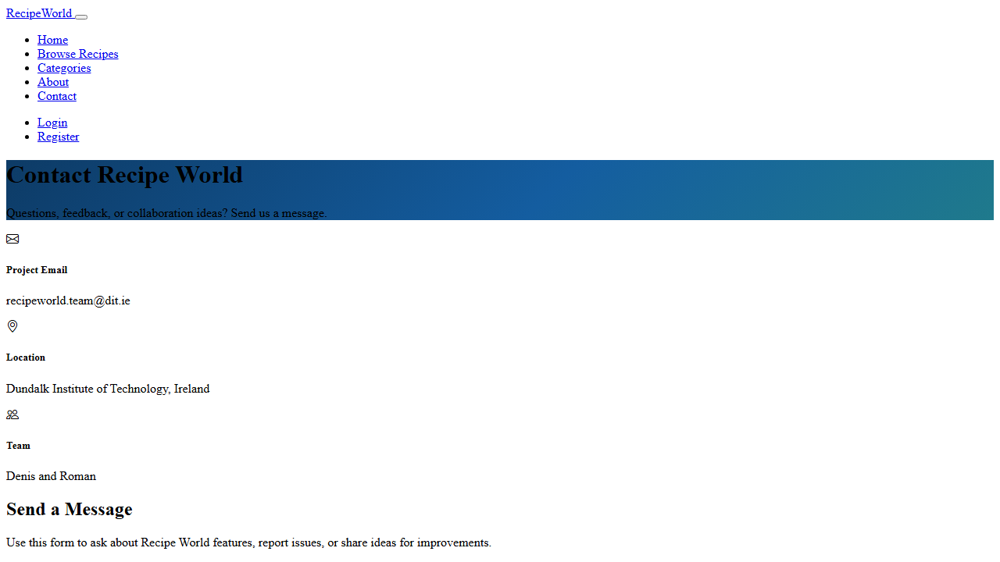
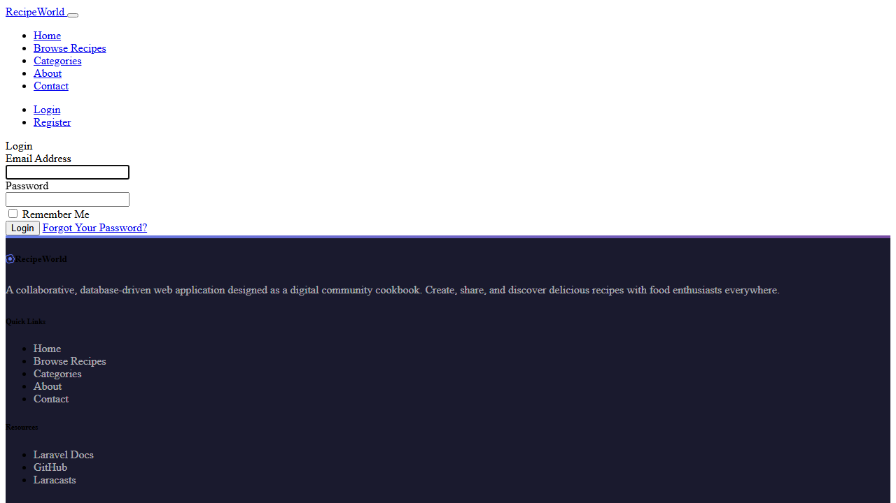

# Recipe World

**Recipe World** is a collaborative, database-driven web application that acts as a digital community cookbook. Built with the Laravel framework, it allows food enthusiasts to create personal accounts, share their favourite recipes, and discover new dishes from the community.

## Live Demo

> **Vercel Public URL:** https://recipe-world-roman.vercel.app

## Deployment

The application is deployed on Vercel with environment variables configured for production.

## Features

- User registration and authentication (Register, Login, Logout)
- Full CRUD operations for recipes (Create, Read, Update, Delete)
- Ingredient management in recipe create/update flows
- Recipe categorisation by type (e.g. Breakfast, Dinner, Dessert)
- Search and filter recipes by keyword, category, or difficulty
- Featured image upload support for recipes
- Automatic slug generation from recipe titles
- Recipe ownership and authorization policies
- Responsive Bootstrap 5 UI
- Pagination support
- Informational pages: About and Contact

## Technology Stack

- **Vercel** - Hosting and deployment platform
- **Laravel 10.x** - PHP web framework
- **MySQL** - Relational database
- **Bootstrap 5** - Frontend styling and layout
- **Vite** - Frontend asset bundling
- **Laravel UI** - Authentication scaffolding
- **Eloquent Sluggable** - Automatic slug generation

## Prerequisites

- PHP 8.1 or higher
- Composer
- MySQL 5.7+ (or MariaDB)
- Node.js 16.x or higher
- NPM

## Installation

### 1. Clone the repository

```bash
git clone <your-repository-url>
cd Recipe-world
```

### 2. Install PHP dependencies

```bash
composer install
```

### 3. Install JavaScript dependencies

```bash
npm install
```

### 4. Environment configuration

```bash
cp .env.example .env
```

Edit `.env` and configure your database settings:

```env
DB_CONNECTION=mysql
DB_HOST=127.0.0.1
DB_PORT=3306
DB_DATABASE=recipe_world_db
DB_USERNAME=root
DB_PASSWORD=
```

### 5. Generate application key

```bash
php artisan key:generate
```

### 6. Create the database

```sql
CREATE DATABASE recipe_world_db CHARACTER SET utf8mb4 COLLATE utf8mb4_unicode_ci;
```

### 7. Run migrations

```bash
php artisan migrate
```

### 8. Create storage link

```bash
php artisan storage:link
```

### 9. Build frontend assets

```bash
npm run dev
```

### 10. Start the development server

```bash
php artisan serve
```

The application will be available at `http://localhost:8000`

## Usage

1. **Register** an account via the top navigation
2. **Browse recipes** shared by the community
3. **Create a recipe** with a title, description, step-by-step instructions, ingredients, cooking times, difficulty level, and a featured image
4. **Edit or delete** your own recipes
5. **Search and filter** recipes by keyword, category, or difficulty

## Screenshots

### About Page



### Contact Page



### Login Page



## Known Issues / Limitations

- Some database-backed pages can be slow or fail intermittently if cloud database network access is not fully configured.
- Vercel Git integration is not yet connected for automatic deploys from repository pushes.
- Persistent local disk writes are not available on Vercel serverless runtime, so storage/logging paths must use serverless-safe configuration.

## Project Structure

```
Recipe-world/
├── app/
│   ├── Http/Controllers/
│   │   └── RecipeController.php       # Recipe CRUD controller
│   ├── Models/
│   │   ├── Recipe.php                 # Recipe model
│   │   ├── Ingredient.php             # Ingredient model
│   │   ├── Category.php               # Category model
│   │   └── User.php                   # User model
│   └── Policies/
│       └── RecipePolicy.php           # Recipe authorization
├── database/
│   └── migrations/                    # Database schema
├── resources/
│   └── views/
│       ├── layouts/app.blade.php      # Main layout
│       ├── recipes/                   # Recipe views
│       └── auth/                      # Auth views
└── routes/
    └── web.php                        # Route definitions
```

## Known Issues & Limitations

- **Contact form** - The contact page includes a form layout for demonstration purposes but does not send emails. A mail driver would need to be configured in production.
- **Image storage** - Uploaded recipe images are stored on the local filesystem via Laravel's `storage/app/public` disk. In a production deployment, a cloud storage solution would be more scalable.
- **No admin role** - Any authenticated user can create, edit and delete categories. A future improvement would add an admin role to restrict category management.

## Assumptions

- Users have PHP 8.1+, Composer, Node.js 16+, and MySQL installed locally for development.
- The application is accessed via a modern web browser (Chrome, Firefox, Safari, Edge).
